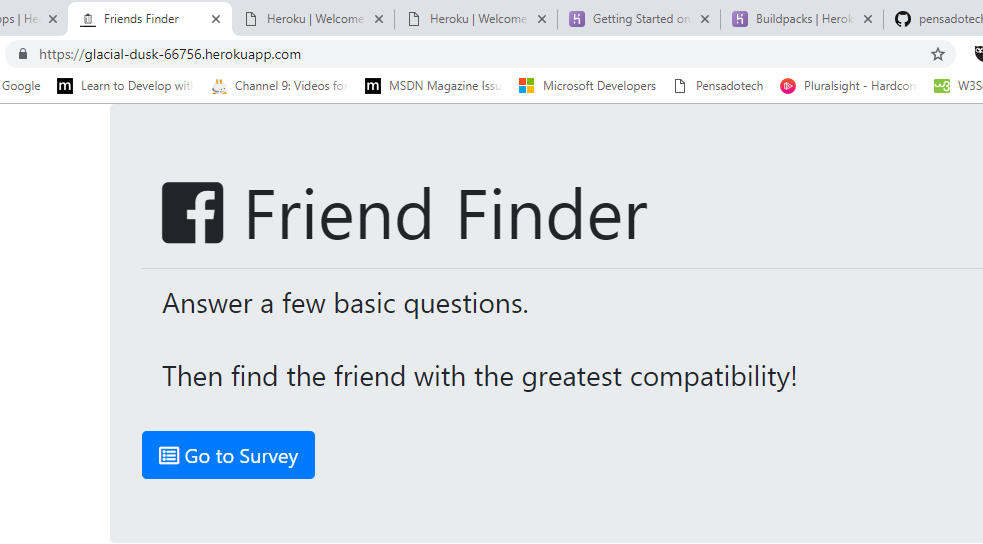
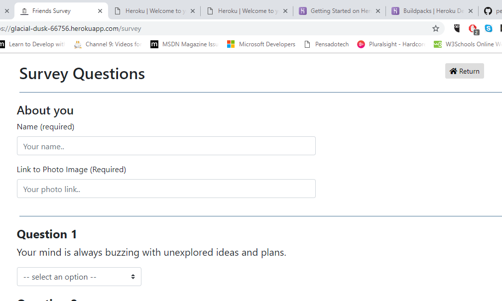
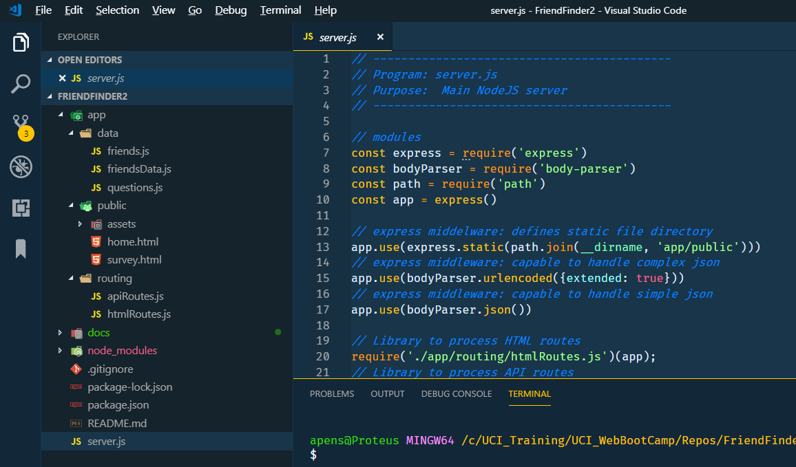

# Friend Finder

_by Armando Pensado_

**Friend Finder** is an application to find compatible friends base on comparing the answer of ten questions.

## Description

The application was made using Node JS and Express, and offers a good example how to put them together to create a server application. Express simplify a great deal the server programming side. 

The application encapsulates html and API routes in different custom modules, keeping separated the functionality.  Additionally, the core functionality of the application is stored under an additional module inside the ‘data’ folder. 

The application stores the questionnaire answers in a array, which is a step away from storing it in a database.

## How does it work

To get a sense of the application running in a server, the reader can try the address under Heroku:

* Heroku: https://glacial-dusk-66756.herokuapp.com/






The application contains ten questions that are exposed to the application user. After providing a name and an URL image, completing the questions, will trigger a comparison event against other people answers. The closest the answer are, the more compatible, assuming the individuals think alike.

The system will bring the closets individual as the most compatible friend.  

## Who can benefit from this application

This application is beneficial for NodeJS developer, providing sample programming structures using JavaScript, and using **Ecxpress**, and custom-made modules that encapsulate the logic.

## How developers can get started

To start, the developer must have NodeJS installed in the computer. After, that the project can be cloned and initialized.  Here are the steps for getting started.

1. Install NodeJS into the computer  (https://nodejs.org/en/). Download button and run through the installation file.

2. Clone or Fork the project into the computer.

3. In the folder project, Make a `.gitignore` file and add the following lines to it. This will tell git not to track these files, and thus they won't be committed to Github.

```js
node_modules
.DS_Store
```

5. Bring all external module dependencies using the command:


```js
node i
```

After, the initialization, and using Microsoft Visual Code, the project folder should resemble as depicted below, and should be ready for execution.



## Who maintains and contributes to the project

This is a personal project based on UCI Bootcamp training. 

## Where users can get help with the project

The developer can refer to the following links


* NodeJs  : https://nodejs.org/en/
* Express : https://www.npmjs.com/package/express
* Heroku  : https://devcenter.heroku.com/articles/getting-started-with-nodejs